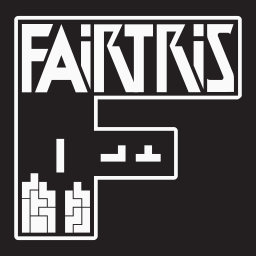

**Fair implementation of Classic Tetris®** 
Copyleft 2021 furious programming. All rights reversed.

 

PC version of the official classic **[Nintendo Tetris®](https://en.wikipedia.org/wiki/Tetris_(NES_video_game))** game for the **[NES](https://en.wikipedia.org/wiki/Nintendo_Entertainment_System)** console, intended for Windows systems. It implements and slightly extends the original mechanics, supports two themes and includes many regional versions and several random piece generators. All in one native executable file!

Ready to play like a true Tetris master? **[Download](https://github.com/furious-programming/Fairtris/releases/download/v2.0.0.2-beta/Fairtris_2.0_beta_release.zip)** and show off!

  

# What is Fairtris?

**Fairtris** is a video game, a clone of the 35-year-old **[Tetris®](https://en.wikipedia.org/wiki/Tetris_(NES_video_game))** game produced by **[Nintendo](https://www.nintendo.com/)** for the **[Famicom](https://en.wikipedia.org/wiki/Nintendo_Entertainment_System)** and **[NES](https://en.wikipedia.org/wiki/Nintendo_Entertainment_System)** consoles, designed for modern Windows systems. **Fairtris is not an emulator** — it is a full-fledged game, created in **[Free Pascal](https://www.freepascal.org/)** language (using the **[Lazarus IDE](https://www.lazarus-ide.org/)**) and with **OpenGL** support via the **[SDL library](https://www.libsdl.org/)**. Thanks to this combination, it is super-fast and ultra-light.

This project was initially created as a tool to test various RNG algorithms, but after some time it turned into a complete and rich video game that provides lots of fun. However, since **Tetris®** is a proprietary brand to which **[The Tetris Company](https://tetris.com/)** is entitled, **Fairtris is not a product**, so its source code and all binaries are public. It is a knowledge base for those who would like to know more about the internal mechanisms of the classic version of this game.

Information on the license can be found in the **[LICENSE](LICENSE)** file. In general, this project is completely free, you can use it for whatever purpose you want, both the entire game and parts of it. Play, share, fork, modify, sell — do what you want, I don't give a fuck about it.  

**General features:**

- implementation of gameplay mechanics compatible with the **[Nintendo Tetris®](https://en.wikipedia.org/wiki/Tetris_(NES_video_game))** game,
- extended mechanics with **hard-drop** and accumulation of soft-drop points,
- support for **EIGHT** regional versions of the game, including original **NTSC** and **PAL** versions,
- support for as many as **SIX** random piece generators, including the classic RNG,
- the ability to start the game from any level, from level `0` up to the killscreen,
- the ability to play on a keyboard or any USB controller,
- supports window mode and the low-resolution exclusive video mode,
- keyboard and controller mapping support,
- support for additional meters, such as **TRT**, **BRN** or gain meter,
- stores the best results for each game region and RNG type,
- has a pause menu with the ability to quickly restart the game and change settings,
- shows the game summary screen after each game,
- support for two themes (minimalistic dark and classic skin),
- possibility to use it with **[NESTrisChamps](https://nestrischamps.herokuapp.com/)** and **[Maxout Club](https://maxoutclub.com/)**,
- it's light and very fast — runs smoothly even on a heavily loaded PC,
- it is fully portable, no installation required,
- and many more!

More detailed information on how to use the game and its mechanics can be found further in this document.

# Compilation and developing

**[Lazarus 2.0.12](https://sourceforge.net/projects/lazarus/)** was used to compile and work on the code, so you should use that as well (or a newer version if available). The **[headers for SDL2](https://github.com/PascalGameDevelopment/SDL2-for-Pascal)** are in the `source\sdl\` subdirectory, while the `.dll` libraries are in the `bin\` folder, where the executable file is created after compilation. So all you need to do is just open the project in **Lazarus** and hit the compile button.

If you are using **Free Pascal IDE** abomination or regular text editor such as **Notepad++**, be sure to somehow add the **SDL** units path in the project settings and well... keep wasting your time.
