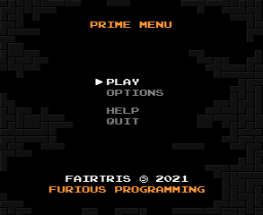
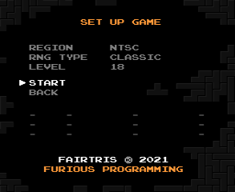
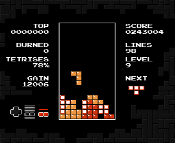
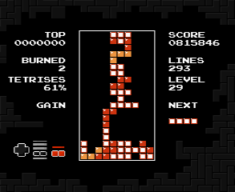
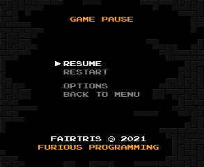
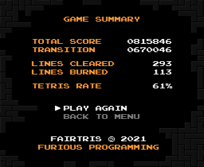
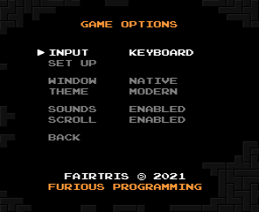
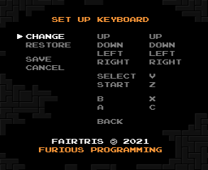
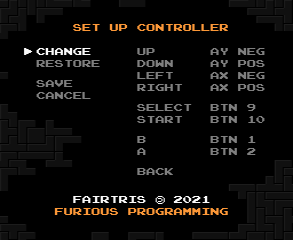

**Fair implementation of Classic Tetris®** 
Copyleft 2021 furious programming. All rights reversed.

 

PC version of the official classic **[Nintendo Tetris®](https://en.wikipedia.org/wiki/Tetris_(NES_video_game))** game for the **[NES](https://en.wikipedia.org/wiki/Nintendo_Entertainment_System)** console, intended for Windows systems. It implements and slightly extends the original mechanics, supports two themes and includes many regional versions and several random piece generators. All in one native executable file!

Ready to play like a true master? **[Download the game](https://github.com/furious-programming/Fairtris/releases/download/v2.3.1.2/fairtris_2.3.1_release.zip)** and show off!

  

# Compilation and developing

**[Lazarus 2.0.12](https://sourceforge.net/projects/lazarus)** was used to compile and work on the code, so you should use that as well (or a newer version if available). The **[headers for SDL2](https://github.com/PascalGameDevelopment/SDL2-for-Pascal)** are in the `source\sdl\` subdirectory, while the `.dll` libraries are in the `bin\` folder, where the executable file is created after compilation. So all you need to do is just open the project in **Lazarus** and hit the compile button.

If you are using **Free Pascal IDE** or regular text editor such as **Notepad++** or **Vim**, be sure to somehow add the **SDL** units path in the project settings and well... keep torturing yourself.

 

# What is Fairtris?

**Fairtris** is a video game, a clone of the 32-year-old **[Tetris®](https://en.wikipedia.org/wiki/Tetris_(NES_video_game))** game produced by **[Nintendo](https://www.nintendo.com)** for the **[Famicom](https://en.wikipedia.org/wiki/Nintendo_Entertainment_System)** and **[NES](https://en.wikipedia.org/wiki/Nintendo_Entertainment_System)** consoles, designed for modern Windows systems. **Fairtris is not an emulator** — it is a full-fledged game, created from scratch in **[Free Pascal](https://www.freepascal.org)** language (using the **[Lazarus IDE](https://www.lazarus-ide.org)**) and with **OpenGL** support via the **[SDL library](https://www.libsdl.org)**. Thanks to this combination, it is super-fast and ultra-light.

This project was initially created as a tool to test various RNG algorithms, but after some time it turned into a complete and rich video game that provides lots of fun. However, since **Tetris®** is a proprietary brand to which **[The Tetris Company](https://tetris.com/)** is entitled, **Fairtris is not a product** — it is a knowledge base for those who would like to know more about the internal mechanisms of the classic version of this game.

 

## Important features

- implementation of gameplay mechanics compatible with the **[Nintendo Tetris®](https://en.wikipedia.org/wiki/Tetris_(NES_video_game))** game,
- **DAS** mechanics fixed and spin buffering added, making the controls fabulously responsive,
- extended mechanics with basic **wall kick**, **hard-drop** and accumulation of soft-drop points,
- support for **EIGHT** regional versions of the game, including original **NTSC** and **PAL** versions,
- support for as many as **SEVEN** random piece generators, including the classic RNG,
- the ability to start the game from any level up to the killscreen,
- the ability to play on a keyboard or any USB controller (with input mapping support),
- supports window mode and exclusive video mode,
- support for additional meters, such as **TRT**, **BRN** or gain meter,
- stores the best results for each game region and RNG type,
- has a pause menu with the ability to quickly restart the game and change settings,
- shows the game summary screen after each game,
- support for two themes (minimalistic dark and classic skin),
- possibility to use it with **[NestrisChamps](https://nestrischamps.herokuapp.com)** and **[MaxoutClub](https://maxoutclub.com)**,
- it's light and very fast — should run smoothly even on a heavily loaded PC,
- it is fully portable, no installation required,
- and many more!

More detailed information on how to handle the game and its mechanics can be found further in this document and also on **[wiki pages](https://github.com/furious-programming/Fairtris/wiki)**. If you want, you can also check out the **[FAQ](https://github.com/furious-programming/Fairtris/wiki/faq)** page where you will find answers to basic questions. If you want to help develop the game, please visit the **[Discord server](https://discord.gg/qQRfEDcTrY)** and write what you think about it.

 

## License

Information on the license can be found in the **[LICENSE](LICENSE)** file. In general, this project is completely free, you can use it for whatever purpose you want, both the entire game and parts of it. So play, share, fork, modify, sell — do what you want, I don't give a shit about it.  

 

# First launch

After extracting the game files from the **[release archive](https://github.com/furious-programming/Fairtris/releases/download/v2.3.1.2/fairtris_2.3.1_release.zip)**, run the `fairtris.exe` file. For the first time, the game starts in the exclusive video mode on the main screen and with the current resolution of that screen, maintaining the appropriate aspect ratio.

Video mode is used by default because it provides the best rendering efficiency. If you prefer the game to be displayed in a small window or generally in windowed mode, so that you can conveniently switch between different applications, turn off video mode by pressing the <kbd>F11</kbd> key. But remember, the rendering performance in windowed mode is always lower.

When the game is running in windowed mode (except fullscreen), you can drag the game window with the left mouse button anywhere on the desktop and on any screen. Additionally, you can change the size of the window with the mouse scroll — scroll forward to enlarge the window or backward to make it smaller. Don't worry — the state of the video mode as well as the size and position of the window are stored in the settings file, so they will be used the next time you start the game.

You can close the game using the appropriate option in the main menu or by pressing <kbd>Alt+F4</kbd>.

 

# Default controls

**Fairtris** is controlled by the keyboard by default, and if a game controller is plugged in and set as main input device, also with it. All the game menus can be operated with both devices, while the game can only be played using the main input device, selected in the **[Game options](game-options)** menu.

Given that the keyboard and controller can be freely mapped, in the remainder of this document, when discussing the **[Gameplay](#gameplay)** scene, general names of the buttons will be given. For more information about device mappings, see **[Set up keyboard](#set-up-keyboard)** and **[Set up controller](#set-up-controller)** sections.

 

## Menu screens

To navigate in the menu, use the <kbd>↑</kbd> <kbd>↓</kbd> keys to change the selected item and <kbd>←</kbd> <kbd>→</kbd> to change the value of the current option. If you want to enter the selected option, press the <kbd>Enter</kbd> key. To go back to the previous menu, press the <kbd>Escape</kbd> key. When mapping keys and buttons, if you want to leave the button unmapped, use the <kbd>Backspace</kbd> key to clear the mapping.

 

## Gameplay

The actual game can be controlled with a keyboard or any USB controller for which separate mappings are provided. The basic set of buttons for this purpose is compatible with the buttons on the **[NES controller](https://en.wikipedia.org/wiki/Nintendo_Entertainment_System#Controllers)** and can be freely mapped. By default, the <kbd>←</kbd> <kbd>→</kbd> <kbd>↑</kbd> <kbd>↓</kbd> keys are used to move and drop pieces, and the <kbd>X</kbd> and <kbd>C</kbd> keys are used to rotate them. The <kbd>Z</kbd> key is used to pause the game, while the <kbd>V</kbd> key is used to show or hide the next piece. The controller buttons are mapped by default according to the general button layout standards, where the `X` and `Y` axes are responsible for moving and dropping pieces, and the first two buttons for rotating them.

If after connecting the controller for the first time, you cannot control the game, use the keyboard and go to the **[Set up game](#set-up-game)** screen, select the controller as the main input device, and then go to the **[Set up controller](#set-up-controller)** screen, where you can set the controller mapping your way.

 

## Special functions

In addition to the basic buttons, some keys have special functions assigned permanently and cannot be used when mapping. If you need help, press the <kbd>F1</kbd> key. To toggle the exclusive video mode, press <kbd>F11</kbd>. To toggle visibility of the first and last tiles row (for the **[NestrisChamps](https://nestrischamps.herokuapp.com)** and **[MaxoutClub](https://maxoutclub.com)** purposes), use the <kbd>F10</kbd> key.

 

# Game scenes

The game contains eight significant scenes that the player should become familiar with. It starts with a short intro with general information and then the main menu pops up. The main menus and submenus allow you to choose your gameplay configuration, as well as change display and sound settings, and the settings of input devices, before you start playing.

 

## Prime menu

The main menu of the game to choose what you want to do. Use the <kbd>↑</kbd> <kbd>↓</kbd> keys to navigate and the <kbd>Enter</kbd> key to choose the selected item.

By selecting the `PLAY` option, you will be taken to the gameplay configuration menu, where you will be able to select the game region, RNG type, starting level and of course start the game.

If you select the `OPTIONS` item, you will be taken to the game settings menu. There you will be able to select the main input device, change the window size and mouse scroll behavior, as well as select the game skin or enable/disable the sound effects. You will also find there an input mapping option.

If you don't know how to operate the game or want to learn more about it, please select the `HELP` option or press the <kbd>F1</kbd> button to minimize the game window and open the user manual in your web browser.

The `QUIT` option is used to close the game and return to the desktop. You can safely close the game at any time also using the <kbd>Alt+F4</kbd> shortcut — all important game data will be saved, so don't worry.

 

## Set up game

The main gameplay settings menu. Use the <kbd>↑</kbd> <kbd>↓</kbd> keys to navigate, <kbd>←</kbd> <kbd>→</kbd> keys to change the value of the selected item, the <kbd>Enter</kbd> key to choose the selected item and the <kbd>Escape</kbd> key to go back to the previous menu.

The `REGION` option is used to select the regional version of the game. There are four basic versions available, and each of them has an additional extended version, which is characterized by a longer gameplay. For more information, see **[Game regions](#game-regions)** section.

The `RNG TYPE` option allows you to choose one of seven different randomizing algorithms. Each algorithm is different and gives sequences of different quality — some easier with an even pieces distribution, and others more challanging, not avoiding drought and floods. See **[RNG algorithms](#rng-algorithms)** for more details.

The third option is `LEVEL`, which allows you to select the starting level of the game. It is possible to choose any level, so you can both play single games and train playing on killscreen. The range of levels that can be selected depends on the selected region.

The best three results are displayed at the bottom of the screen, according to the selected regional version and RNG type. There is a separate list for each combination, so the game can store up to `168` results with basic information about the games played.

If you want to start the game according to the selected settings, choose the `START` option. If you need to go back to the game **[Prime menu](#prime-menu)**, choose the `BACK` option.

 

### Game regions

Even though the original **[Nintendo Tetris®](https://en.wikipedia.org/wiki/Tetris_(NES_video_game))** was only released in two regional versions (for **NTSC** and **PAL** television standards), **Fairtris** has four base versions. The additional two versions are modifications of the original ones, with different **[DAS](https://www.youtube.com/watch?v=JeccfAI_ujo)** speed and improved gravity. In addition, each base region has an additional, extended version that has the correct line count calculations for the transitions. Thanks to this, no matter what level we start from, killscreen always occurs at `290` lines.

If you want to know more about the available regions, check out page **[Game regions](https://github.com/furious-programming/Fairtris/wiki/game-regions)** in the **[wiki](https://github.com/furious-programming/Fairtris/wiki)**.

 

### RNG algorithms

The original game has only one generator, characterized by the generation of shitty sequences, filled with frequent droughts and floods, which effectively and completely unfairly take away the player's score potential and, consequently, the desire to play. Many controllers have been smashed by how badly the Nintendo developers have broken their game.

In order not to limit the possibilities of the game and not to spoil it like the original, **Fairtris**, in addition to supporting the classic generator, also implements six additional ones, providing different levels of difficulty.

If you want to learn more, check out page **[RNG algorithms](https://github.com/furious-programming/Fairtris/wiki/rng-algorithms)** in the **[wiki](https://github.com/furious-programming/Fairtris/wiki)**.

 

## Gameplay

The gameplay is almost the same as in the **[Nintendo Tetris®](https://en.wikipedia.org/wiki/Tetris_(NES_video_game))**.

Use the <kbd>←</kbd> <kbd>→</kbd> buttons to shift the pieces — you can press them quickly or use the automatic shifting function called **[DAS](https://www.youtube.com/watch?v=JeccfAI_ujo)**. The charging time of the **DAS** and the speed of shifting depends on the selected **[region](#game-regions)**. To rotate the pieces, use the <kbd>B</kbd> and <kbd>A</kbd> buttons (counterclockwise and clockwise respectively).

If you are a more advanced player or just want to play faster, you can use <kbd>↓</kbd> to drop pieces faster (this is called **soft-drop**). Unlike the original game, **Fairtris** also supports **hard-drop**, available under the <kbd>↑</kbd> button (but the *“ghost-piece”* is never visible). It allows you to achieve the highest playing speed, which is definitely useful for true speedruns.

The **soft-drop** feature, unlike in the original game, correctly calculates *“push-down”* points. Not only that, it is not reset between spawns, so *“push-down”* points can be accumulated, which is a small reward for the player to play faster and smarter. Skill should always be rewarded.

Pressing the <kbd>Select</kbd> button during the game allows you to show or hide the next piece. The <kbd>Start</kbd> button is used to suspend the game and open a **[Game pause](#game-pause)** menu where you can conveniently restart the game, and if you need to, also enter the **[Game options](#game-options)** panel or leave the current game and return to the **[Set up game](#set-up-game)** menu.

Depending on the selected theme, different information is displayed around the playing field. The `CLASSIC` skin is same as in the original game and displays only basic information, such as the score and cleared lines counters, the level number and distribution statistics of individual pieces. The next piece and the best result are also shown. This theme is intended mainly for competitive play with tools such as **[NestrisChamps](https://nestrischamps.herokuapp.com)** and **[MaxoutClub](https://maxoutclub.com)**.

If you choose the `MODERN` theme, you will not only have access to more information, but also to a less bright, tiring and flashing interface. The modern interface doesn't have pieces statistics, but it additionally displays the number of lines burned from the previous tetris, the percentage of tetris in the total number of lines cleared, as well as the gain counter, which shows in real time how many points was added to the score counter. And in the lower left corner it displays a controller thumbnail with pressed buttons.

When you reach the topout, the game will wait for the <kbd>Start</kbd> button to be pressed, without covering the playing field. You can use this time to e.g. take a screenshot. After pressing the <kbd>Start</kbd> button, the **[Game summary](#game-summary)** screen will be displayed.

 

## Game pause

When you pause the game, this screen will appear. Use the <kbd>↑</kbd> <kbd>↓</kbd> keys to navigate and the <kbd>Enter</kbd> key or <kbd>Start</kbd> button to choose the selected option.

Select the `RESUME` option to resume a paused game. If you want to play again, select the `RESTART` option. If you unplug the main input device from your computer in the meantime, these two items will be disabled until you reconnect it or change the input device in the settings menu.

Select the `OPTIONS` item to go to the game settings panel. This will open up exactly the same settings panel as the one available from the **[Prime menu](#prime-menu)** of the game, so you will be able to change the settings of all game functions, from the type and mapping of input devices and the theme, to the size of the window and the state of sound effects.

If you don't want to play anymore or want to change the gameplay settings, select `BACK TO MENU` to return to the **[Set up game](#set-up-game)** menu.

 

## Game summary

Screen with the basic statistics of the game played. Use the <kbd>↑</kbd> <kbd>↓</kbd> keys to navigate and the <kbd>Enter</kbd> key to choose the selected item. You can also use the <kbd>Escape</kbd> key to go back to the **[Set up game](#set-up-game)** menu.

The most important information in the summary is the total number of points earned, visible at the top of the screen. The second counter shows the number of points for the transition to level `19` (or `20` if you started the game from level `19`).

The total number of lines cleared is displayed below, as well as the number of lines burned (cleared in the other way than tetrising). The last row shows the percentage of tetrises in the total number of cleared lines. The value of this counter freezes after reaching the killscreen, so if you achieve the **100%** tetris rate, then burning the lines on killscreen will not lower it.

If you are already familiar with the game statistics, choose the `PLAY AGAIN` option to start a new game. If you want to go back to the **[Set up game](#set-up-game)** menu, choose the `BACK TO MENU` item.

 

## Game options

This is the main game settings panel, available both from the **[Prime menu](#prime-menu)** of the game and in the **[Game pause](#game-pause)** menu. Use the <kbd>↑</kbd> <kbd>↓</kbd> keys to navigate, <kbd>←</kbd> <kbd>→</kbd> keys to change the value of the selected item, the <kbd>Enter</kbd> key to choose the selected item and the <kbd>Escape</kbd> key to go back to the previous menu.

The first option in this menu is to set the main input device — if you want to play the keyboard, set it to `KEYBOARD`, and if you prefer to play with a controller, select the `CONTROLLER` option. To go to device mapping, go to the `SET UP` option — you will be taken to the **[Set up keybaord](#set-up-keyboard)** or **[Set up controller](#set-up-controller)** menu, depending on the selected device type. This option is disabled if the selected device is not connected or if it is not working properly.

Another option is `WINDOW` which allows you to choose the size of the game window. Various sizes are available, from native to fullscreen. This option is disabled if exclusive video mode is active. The `THEME` option allows you to choose one of two graphic themes. If you want to play more conveniently and have access to additional statistics, choose the `MODERN` theme. However, if you prefer a classic skin or if you want to play with someone via **[NestrisChamps](https://nestrischamps.herokuapp.com)** or **[MaxoutClub](https://maxoutclub.com)** tools, choose the `CLASSIC` theme.

Next we have the option `SOUNDS`, which allows you to enable or disable the playback of sound effects in all menus and during the game. The `SCROLL` option, on the other hand, allows you to unlock or block the ability to change the size of the window with the mouse wheel (this function is available only in windowed mode).

Select `BACK` to go back to the previous menu.

 

## Set up keyboard

Keyboard key mapping menu. Use the <kbd>↑</kbd> <kbd>↓</kbd> keys to navigate and the <kbd>Enter</kbd> key to choose the selected item. You can also use the <kbd>Escape</kbd> key to go back to the **[Game options](#game-options)** menu.

Enter the `CHANGE` option to activate the right menu. To change the key assigned to a function, highlight the desired item, then press <kbd>Enter</kbd> key — the item will start blinking and then press the key you want to assign to that function (or <kbd>Escape</kbd> to cancel the setting). If you need to remove a key assignment, highlight the item and press the <kbd>Backspace</kbd> key. If the selected key is already assigned to another function, the key will be set for the current one and the duplicate will be cleared. After setting the mapping, select the `BACK` option or press the <kbd>Escape</kbd> key to activate the menu on the left.

If you want to restore the factory keyboard mapping, select the `RESTORE` option. To save your changes, select the `SAVE` option — the new settings will be saved and you will be taken to the **[Game options](#game-options)** menu. To cancel the changes made and return to the previous menu, select the `CANCEL` option or press the <kbd>Escape</kbd> key again.

### Important

When changing the key mapping in the right-hand menu, the newly assigned keys are not active yet. The changes will be applied only after returning to the left menu and selecting the `SAVE` option. Not all keys need to be mapped — the <kbd>Select</kbd> function may not have a key assigned to it. However, if not all the required keys are set, the saving changes will be disabled.

 

## Set up controller

The functionality of this menu is identical to the **[Set up keyboard](#set-up-keyboard)** menu, except for mapping USB controllers. Use the <kbd>↑</kbd> <kbd>↓</kbd> keys to navigate and the <kbd>Enter</kbd> key to choose the selected item. You can also use the <kbd>Escape</kbd> key to go back to the **[Game options](#game-options)** menu.

Select the `CHANGE` option to start mapping the controller buttons. To change the mapping of a given function, select the appropriate item in the menu on the right and press the <kbd>Enter</kbd> key — when the item starts blinking, press one button on the controller (or <kbd>Escape</kbd> to cancel the setting). If the same button is used again, the duplicate will be cleared. To clear the mapping of a function, highlight it and press the <kbd>Backspace</kbd> key. When finished, select the `BACK` option or press the <kbd>Escape</kbd> key to return to the left menu.

If you want to restore the factory mapping of the controller, please select the `RESTORE` option. To save your changes, select the `SAVE` option — the mapping will be saved and introduced, and you will be taken to the **[Game options](#game-options)** menu. If you do not want to save the changes made, select the `CANCEL` option or press the <kbd>Escape</kbd>.

### Important

Newly assigned buttons for functions in the right-hand menu are not applied immediately. The changes made will be saved only after going back to the left menu and selecting the `SAVE` option. If you don't want to, you don't have to assign buttons to all functions. You can skip the mapping of the `UP`, `DOWN` and `SELECT` functions, but thus you won't be able to drop pieces faster or show/hide the next piece. If you don't assign buttons to all required functions, the `SAVE` option will be disabled.

 

# Bindings

This project is designed for 64-bit **Windows** platforms only. If someone decides to port the code and release a version to other platforms, such as **Linux**, **FreeBSD** or **macOS**, the repository links will be added to this section.

 

# Acknowledgments and useful links

During the development of the game, and in particular during the reconstruction of the original **[Nintendo Tetris®](https://en.wikipedia.org/wiki/Tetris_(NES_video_game))** mechanics and the `CLASSIC` random piece generator used in it, I relied heavily on the knowledge contained in the article **[Applying Artificial Intelligence to Nintendo Tetris](https://meatfighter.com/nintendotetrisai)** and the source code from the **[TetrisNESDisasm](https://github.com/CelestialAmber/TetrisNESDisasm)** repository. In addition, the `TMG` and `TGM TERROR` generators was implemented based on the **[The history of Tetris randomizers](https://simon.lc/the-history-of-tetris-randomizers)** article. Huge thanks the authors of these materials for sharing their valuable knowledge.

To test some of the behavior of the original game, I used the **[FCEUX](http://fceux.com)** emulator and some modified ROMs which was also very helpful. Thanks are also due to the authors of the **[NestrisChamps](https://nestrischamps.herokuapp.com)** and **[MaxoutClub](https://maxoutclub.com)** tools, thanks to which it is possible to use **Fairtris** for an online competitive game. Many thanks to the authors of **[Lazarus](https://www.lazarus-ide.org/)**, the **[SDL2 headers](https://github.com/PascalGameDevelopment/SDL2-for-Pascal)** and the **[SDL library](https://www.libsdl.org)**. These tools allowed for the convenient creation of the **Fairtris** in a light and super-fast form.

The last dose of thanks goes to the Polish community putting a lot of work into the development of the Polish (and not only) classic **Tetris** scene, focused on the **[Classic Tetris Polska](https://discord.gg/QXPv3RSZ)** server on **[Discord](https://discord.com/)**. Thanks are also due to the **[4programmers.net](https://4programmers.net/)** and **[Free Pascal](https://forum.lazarus.freepascal.org/)** community for testing the game and feedback.
