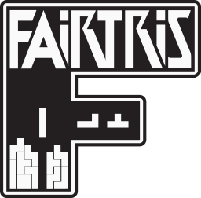

**Fair implementation of Classic Tetris®** 
Copyleft 2021 furious programming. All rights reversed.

 

PC version of the official classic **[Nintendo Tetris®](https://en.wikipedia.org/wiki/Tetris_(NES_video_game))** game for the **[NES](https://en.wikipedia.org/wiki/Nintendo_Entertainment_System)** console, intended for Windows systems. It implements and slightly extends the original mechanics, supports two themes and includes many regional versions and several random piece generators. All in one native executable file!

Ready to play like a true Tetris master? **[Download the game](https://github.com/furious-programming/Fairtris/releases/download/v2.0.0.2-beta/Fairtris_2.0_beta_release.zip)** and show off!

  

# Compilation and developing

**[Lazarus 2.0.12](https://sourceforge.net/projects/lazarus)** was used to compile and work on the code, so you should use that as well (or a newer version if available). The **[headers for SDL2](https://github.com/PascalGameDevelopment/SDL2-for-Pascal)** are in the `source\sdl\` subdirectory, while the `.dll` libraries are in the `bin\` folder, where the executable file is created after compilation. So all you need to do is just open the project in **Lazarus** and hit the compile button.

If you are using **Free Pascal IDE** abomination or regular text editor such as **Notepad++** or **Vim**, be sure to somehow add the **SDL** units path in the project settings and well... keep torturing yourself.

 

# What is Fairtris?

**Fairtris** is a video game, a clone of the 35-year-old **[Tetris®](https://en.wikipedia.org/wiki/Tetris_(NES_video_game))** game produced by **[Nintendo](https://www.nintendo.com)** for the **[Famicom](https://en.wikipedia.org/wiki/Nintendo_Entertainment_System)** and **[NES](https://en.wikipedia.org/wiki/Nintendo_Entertainment_System)** consoles, designed for modern Windows systems. **Fairtris is not an emulator** — it is a full-fledged game, created from scratch in **[Free Pascal](https://www.freepascal.org)** language (using the **[Lazarus IDE](https://www.lazarus-ide.org)**) and with **OpenGL** support via the **[SDL library](https://www.libsdl.org)**. Thanks to this combination, it is super-fast and ultra-light.

This project was initially created as a tool to test various RNG algorithms, but after some time it turned into a complete and rich video game that provides lots of fun. However, since **Tetris®** is a proprietary brand to which **[The Tetris Company](https://tetris.com/)** is entitled, **Fairtris is not a product** — it is a knowledge base for those who would like to know more about the internal mechanisms of the classic version of this game.

 

## Important features

- implementation of gameplay mechanics compatible with the **[Nintendo Tetris®](https://en.wikipedia.org/wiki/Tetris_(NES_video_game))** game,
- extended mechanics with **hard-drop** and accumulation of soft-drop points,
- support for **EIGHT** regional versions of the game, including original **NTSC** and **PAL** versions,
- support for as many as **SIX** random piece generators, including the classic RNG,
- the ability to start the game from any level up to the killscreen,
- the ability to play on a keyboard or any USB controller (with input mapping support),
- supports window mode and the low-resolution exclusive video mode,
- support for additional meters, such as **TRT**, **BRN** or gain meter,
- stores the best results for each game region and RNG type,
- has a pause menu with the ability to quickly restart the game and change settings,
- shows the game summary screen after each game,
- support for two themes (minimalistic dark and classic skin),
- possibility to use it with **[NestrisChamps](https://nestrischamps.herokuapp.com)** and **[MaxoutClub](https://maxoutclub.com)**,
- it's light and very fast — runs smoothly even on a heavily loaded PC,
- it is fully portable, no installation required,
- and many more!

More detailed information on how to handle the game and its mechanics can be found further in this document.

 

## License

Information on the license can be found in the **[LICENSE](LICENSE)** file. In general, this project is completely free, you can use it for whatever purpose you want, both the entire game and parts of it. So play, share, fork, modify, sell — do what you want, I don't give a shit about it.  

 

# First launch

After extracting the game files from the **[archive](https://github.com/furious-programming/Fairtris/releases/download/v2.0.0.2-beta/Fairtris_2.0_beta_release.zip)**, run the `fairtris.exe` file. For the first time, the game runs in an exclusive video mode with a resolution of `800×600` pixels, displaying the window on the entire main screen, maintaining the appropriate aspect ratio.

Video mode is used by default because it provides the best rendering efficiency. If you prefer the game to be displayed in a small window or generally in windowed mode, so that you can conveniently switch between different applications, turn off video mode by pressing the <kbd>F11</kbd> key. But remember, the rendering performance in windowed mode is lower.

When the game is running in windowed mode (except fullscreen), you can drag the game window with the left mouse button anywhere on the desktop and on any screen. Additionally, you can change the size of the window with the mouse scroll — scroll forward to enlarge the window or backward to make it smaller. Don't worry — the state of the video mode as well as the size and position of the window are stored in the settings file, so they will be used the next time you start the game.

You can close the game using the appropriate option in the main menu or by pressing <kbd>Alt+F4</kbd>.

 

# Default controls

**Fairtris** is controlled by the keyboard by default, and if a game controller is plugged in and set as main input device, also with it. All the game menus can be operated with both devices, while the game can only be played using the main input device. The control looks the same as in emulators (e.g. in **FCEUX**), where one set of keyboard keys or controller buttons is used for navigating in the menu and for playing. There is no distinction between keys for menus and game keys, so you don't have to change your hand layout when switching between scenes.

The basic set of buttons for operating the game is compatible with the buttons on the **[NES controller](https://en.wikipedia.org/wiki/Nintendo_Entertainment_System#Controllers)**.

| NES controller button | Keyboard key equivalent | USB controller button equivalent |
|---|---|---|
| <kbd>↑</kbd> <kbd>↓</kbd> <kbd>←</kbd> <kbd>→</kbd> | <kbd>↑</kbd> <kbd>↓</kbd> <kbd>←</kbd> <kbd>→</kbd> | <kbd>↑</kbd> <kbd>↓</kbd> <kbd>←</kbd> <kbd>→</kbd> (D-pad or left analog stick) |
| <kbd>Select</kbd> | <kbd>V</kbd> | <kbd>Button 9</kbd> |
| <kbd>Start</kbd> | <kbd>Z</kbd> | <kbd>Button 10</kbd> |
| <kbd>B</kbd> | <kbd>X</kbd> | <kbd>Button 1</kbd> |
| <kbd>A</kbd> | <kbd>C</kbd> | <kbd>Button 2</kbd> |

Given that the keyboard and controller can be freely mapped, in the remainder of this document, when discussing the game scenes, general names of the buttons will be given (those listed in the table above, in the column `NES controller button`).

 

In addition to the basic buttons, some keys have special functions assigned permanently. These keys cannot be used for any other purpose, therefore do not try to use them when mapping the keyboard.

| Keyboard&nbsp;key | Assigned function |
|---|---|
| <kbd>F1</kbd> | Minimizes the game window and opens the user manual in the browser (actually: this document). This function is available in all game scenes. |
| <kbd>F2</kbd> | Sets the keyboard as the default input device and restores the factory keyboard and controller mapping. This feature is available in every game scene and should be used when the player has no idea how to set the controls. |
| <kbd>F10</kbd> | Toggles the rendering of black bars at the top and bottom of the game image. This function is intended to facilitate image calibration for **[NestrisChamps](https://nestrischamps.herokuapp.com)** and **[MaxoutClub](https://maxoutclub.com)** and can be used in any scene. |
| <kbd>F11</kbd> | Toggles low-resolution exclusive video mode, available at any time. |
| <kbd>Backspace</kbd> | Used to remove an assigned key or button when mapping an input device. |
| <kbd>Escape</kbd> | Cancels waiting for a key or button press when mapping an input device. |

For more information about device mapping and the purpose of specific keys and buttons, see **[Set up keyboard](#set-up-keyboard)** and **[Set up controller](#set-up-controller)** sections.

 

# Game scenes

The game contains eight significant scenes that the player should become familiar with. It starts with a short intro with general information and then the main menu pops up. The main menus and submenus allow you to choose your gameplay configuration, as well as change display and sound settings, and the settings of input devices, before you start playing.

 

## Prime menu

The main menu of the game to choose what you want to do. Use the <kbd>↑</kbd> <kbd>↓</kbd> buttons to navigate and the <kbd>Start</kbd>/<kbd>A</kbd> button to choose the selected item.

 

By selecting the `PLAY` option, you will be taken to the gameplay configuration menu, where you will be able to select the game region, RNG type, starting level and of course start the game.

If you select the `OPTIONS` item, you will be taken to the game settings menu. There you will be able to select the main input device, change the window size and mouse scroll behavior, as well as select the game skin or enable/disable the sound effects. You will also find there an input mapping option.

If you don't know how to operate the game or want to learn more about it, please select the `HELP` option or press the <kbd>F1</kbd> button to minimize the game window and open the user manual in your web browser.

The `QUIT` option is used to close the game and return to the desktop. You can safely close the game at any time also using the <kbd>Alt+F4</kbd> shortcut — all important game data will be saved, so don't worry.

 

## Set up game

The main gameplay settings menu. Use the <kbd>↑</kbd> <kbd>↓</kbd> buttons to navigate, <kbd>←</kbd> <kbd>→</kbd> buttons to change the value of the selected item, the <kbd>Start</kbd>/<kbd>A</kbd> button to choose the selected item and the <kbd>B</kbd> button to go back to the previous menu.

 

The `REGION` option is used to select the regional version of the game. There are four basic versions available, and each of them has an additional extended version, which is characterized by a longer gameplay. For more information, see **[Game regions](#game-regions)** section.

The `RNG TYPE` option allows you to choose one of six different randomizing algorithms. Each algorithm is different and gives sequences of different quality — some easier with an even pieces distribution, and others more challanging, not avoiding drought and floods. See **[RNG algorithms](#rng-algorithms)** for more details.

The third option is `LEVEL`, which allows you to select the starting level of the game. It is possible to choose any level, so you can both play single games and train playing on killscreen. The range of levels that can be selected depends on the selected region.

The best three results are displayed at the bottom of the screen, according to the selected regional version and RNG type. There is a separate list for each combination, so the game can store up to `48` results with basic information about the games played.

If you want to start the game according to the selected settings, choose the `START` option. If you need to go back to the game **[Prime menu](#prime-menu)**, choose the `BACK` option.

 

### Game regions

Even though the original **[Nintendo Tetris®](https://en.wikipedia.org/wiki/Tetris_(NES_video_game))** was only released in two regional versions (for **NTSC** and **PAL** television standards), **Fairtris** has four base versions. The additional two versions are modifications of the original ones, with different **[DAS](https://www.youtube.com/watch?v=JeccfAI_ujo)** speed and improved gravity. In addition, each base region has an additional, extended version that has the correct line count calculations for the transitions. Thanks to this, no matter what level we start from, killscreen always occurs at `290` lines.

- `NTSC` — equivalent to original **NTSC** version, without any major modifications, running at 60 frames per second. The `EXTENDED` version is similar but with the correct calculations of the transition lines count.

- `JPN` — hypothetical version, it has gravity from the **NTSC** version, but the **[DAS](https://www.youtube.com/watch?v=JeccfAI_ujo)** speed is the same as in **PAL** (faster by one frame, so it is possible to play on killscreen). The `EXTENDED` version additionally computes transition lines correctly. Also works at 60fps.

- `PAL` — equivalent to the original **PAL** version, without any significant mechanics modifications. The `EXTENDED` version doesn't support the line count bug for transition, so the game is much longer. Just like the original, it works at 50 frames per second.

- `EUR` — another hypothetical region, it runs at 50fps, the speed of the **[DAS](https://www.youtube.com/watch?v=JeccfAI_ujo)** is consistent with the **PAL** version, however the gravity for each level was calculated from scratch and is similar to that of the **NTSC**. The feeling of the game is as if an American cartridge was inserted into the European console. The `EXTENDED` version additionally has the correct transition lines count calculations.

For the regions `PAL` and `PAL EXTENDED`, you can select the start level up to `19`, and for all other regions up to `29`. In short, the highest possible level to choose from is always the first killscreen level of the selected regional version. 

 

### RNG algorithms

The original game has only one generator, characterized by the generation of shitty sequences, filled with frequent droughts and floods, which effectively and completely unfairly take away the player's score potential and, consequently, the desire to play. Many controllers have been smashed by how badly the Nintendo developers have broken their game.

In order not to limit the possibilities of the game and not to spoil it like the original, **Fairtris**, in addition to supporting the classic generator, also implements five additional ones, providing different levels of difficulty.

- `7-BAG` — the pieces set (one of each type) is put in the bag and then the pieces are randomly pulled out of it, one by one. Once the bag is empty, the pieces go back in and the whole process is repeated. The history isn't used, therefore snake sequences are possible, albeit short. The maximum flood is `2`, the longest drought is `12`. Plus, it's predictable.

- `MULTI-BAG` — a variation of the previous one, except that instead of one bag, seven are used, and in each of them, instead of seven pieces, there are eight (one piece type is duplicated). Since there are the same number of pieces of each type in all bags (eight in total), the distribution always tends to be equal. Due to the pieces duplication in the bags, the maximum flood is `3`, while the longest drought can be `14`. The sequence quality is slightly better than the **7-bag** and more challenging.

- `CLASSIC` — implementation of the original generator, existing in **[Nintendo Tetris®](https://en.wikipedia.org/wiki/Tetris_(NES_video_game))**. Its operation is very naive — it generates a pseudo-random number and converts it into a Tetrimino type. If the newly selected piece is the same as the previous one, it generates the number once again and determines the piece type from it. Annoying RNG, because very often it generates floods up to `8` same pieces in a row, and in each game it causes long droughts that last up to even `80` (although in theory the drought can last forever). Additionally, its operation can be manipulated by using a **soft-drop**. Good job, Nintendo.

- `TGM` — implementation of the generator known from the game **[Tetris: The Grand Master](https://tetris.fandom.com/wiki/Tetris_The_Grand_Master)** (**TGM**). Unlike the generator from the **NES** console, it uses the history of four pieces and randomizes a new one up to four times. As a result, floods are much less frequent, but also droughts, although these can still happen and destroy the game. Decent RNG.

- `TGM TERROR` — the exact implementation of the generator known from the game **[Tetris: The Grand Master 3 - Terror-Instinct](https://tetris.fandom.com/wiki/Tetris_The_Grand_Master_3_Terror-Instinct)** (**TGM3**). Very advanced algorithm, producing the most interesting, challenging and fair sequences. It uses a pool of `35` pieces and the history of the last four, and tries up to six times when drawing a new piece. It largely solves the problems of the bag and the history, a decent compromise between these systems. If you want to have a good time, choose this RNG.

- `UNFAIR` — this generator is the most unstable and unfair, mainly added as a joke. It works the same as `CLASSIC`, but with the difference that it never checks to see if a piece of the same type has been drawn again. As a result, droughts and floods can be incredibly long and the pieces distribution is always uneven. This generator is good for practicing stacking and dealing with difficult situations (and only for that).

All generators work on the basis of the 16-bit **[Linear-Feedback Shift Register](https://en.wikipedia.org/wiki/Linear-feedback_shift_register)** (**LFSR** in short), which is responsible for generating successive pseudo-random numbers used for various purposes by RNG algorithms. This register was used in the original game and therefore **Fairtris** uses it.

If you want to know more about it, read the article **[Applying Artificial Intelligence to Nintendo Tetris](https://meatfighter.com/nintendotetrisai)**, section **[Picking Tetriminos](https://meatfighter.com/nintendotetrisai/#Picking_Tetriminos)**. If you want to know more about the **[TGM](https://tetris.fandom.com/wiki/Tetris_The_Grand_Master)** and **[TGM3](https://tetris.fandom.com/wiki/Tetris_The_Grand_Master_3_Terror-Instinct)** algorithms, see article **[The history of Tetris randomizers](https://simon.lc/the-history-of-tetris-randomizers)**.

 

## Gameplay

The gameplay is almost the same as in the **NES** version.

Use the <kbd>←</kbd> <kbd>→</kbd> buttons to shift the pieces — you can press them quickly or use the automatic shifting function called **[DAS](https://www.youtube.com/watch?v=JeccfAI_ujo)**. The charging time of the **DAS** and the speed of shifting depends on the selected **[region](#game-regions)**. To rotate the pieces, use the <kbd>B</kbd> and <kbd>A</kbd> buttons (counterclockwise and clockwise respectively).

If you are a more advanced player or just want to play faster, you can use <kbd>↓</kbd> to drop pieces faster (this is called **soft-drop**). Unlike the original game, **Fairtris** also supports **hard-drop**, available under the <kbd>↑</kbd> button (but the *“ghost-piece”* is not visible). It allows you to achieve the highest playing speed, which is definitely useful for speedruns.

The **soft-drop** feature, unlike in the original game, correctly calculates *“push-down”* points. Not only that, it is not reset between spawns, so *“push-down”* points can be accumulated, which is a small reward for the player to play faster and smarter. Skill should always be rewarded.

Pressing the <kbd>Select</kbd> button during the game allows you to show or hide the next piece. The <kbd>Start</kbd> button is used to suspend the game and open a **[Game pause](#game-pause)** menu where you can conveniently restart the game, and if you need to, also enter the **[Game options](#game-options)** panel or leave the current game and return to the **[Set up game](#set-up-game)** menu.

 

Depending on the selected theme, different information is displayed around the playing field. The `CLASSIC` skin is same as in the original game and displays only basic information, such as the score and cleared lines counters, the level number and distribution statistics of individual pieces. The next piece and the best result are also shown. This theme is intended mainly for competitive play with tools such as **[NestrisChamps](https://nestrischamps.herokuapp.com)** and **[MaxoutClub](https://maxoutclub.com)**.

If you choose the `MODERN` theme, you will not only have access to more information, but also to a less bright, tiring and flashing interface. The modern interface doesn't have pieces statistics, but it additionally displays the number of lines burned from the previous tetris, the percentage of tetris in the total number of lines cleared, as well as the gain counter, which shows in real time how many points was added to the score counter. And in the lower left corner it displays a controller thumbnail with pressed buttons.

 

When you reach the topout, the game will wait for the <kbd>Start</kbd> button to be pressed, without covering the playing field. You can use this time to e.g. take a screenshot. After pressing the <kbd>Start</kbd> button, the **[Game summary](#game-summary)** screen will be displayed.

 

## Game pause

When you pause the game, this screen will appear. Use the <kbd>↑</kbd> <kbd>↓</kbd> buttons to navigate and the <kbd>Start</kbd>/<kbd>A</kbd> button to choose the selected option.

 

Select the `RESUME` option to resume a paused game. If you want to play again, select the `RESTART` option. If you unplug the main input device from your computer in the meantime, these two items will be disabled until you reconnect it or change the input device in the settings menu.

Select the `OPTIONS` item to go to the game settings panel. This will open up exactly the same settings panel as the one available from the **[Prime menu](#prime-menu)** of the game, so you will be able to change the settings of all game functions, from the type and mapping of input devices and the theme, to the size of the window and the state of sound effects.

If you don't want to play anymore or want to change the gameplay settings, select `BACK TO MENU` to return to the **[Set up game](set-up-game)** menu.

 

## Game summary

Screen with the basic statistics of the game played. Use the <kbd>↑</kbd> <kbd>↓</kbd> buttons to navigate and the <kbd>Start</kbd>/<kbd>A</kbd> button to choose the selected item. You can also use the <kbd>B</kbd> button to go back to the **[Set up game](#set-up-game)** menu.

The most important information in the summary is the total number of points earned, visible at the top of the screen. The second counter shows the number of points for the transition to level `19` (or `20` if you started the game from level `19`).

The total number of lines cleared is displayed below, as well as the number of lines burned (cleared in the other way than tetrising). The last row shows the percentage of tetrises in the total number of cleared lines. The value of this counter freezes after reaching the killscreen, so if you achieve the **100%** tetris rate, then burning the lines on killscreen will not lower it.

 

If you are already familiar with the game statistics, choose the `PLAY AGAIN` option to start a new game. If you want to go back to the **[Set up game](#set-up-game)** menu, choose the `BACK TO MENU` item.

 

## Game options

*content needed*

 

## Set up keyboard

*content needed*

 

## Set up controller

*content needed*

  

*The content of this document is not finished yet, so stay tuned.*
